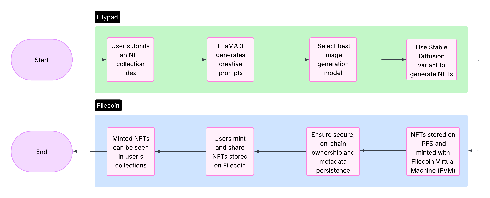

# NiftyBAY: Decentralized NFT Platform

> A Next.js powered platform for AI-generated NFTs using Lilypad and Filecoin

A decentralized NFT minting, trading, and showcasing platform powered by Lilypad's AI capabilities and Filecoin's decentralized storage. Think of it as social media for NFTs, where users can flaunt, trade, and showcase their collections with ease.




## ✨ Features

- **AI-Powered NFT Creation** - Generate unique NFT collections with text prompts using LLaMA 3 and Stable Diffusion
- **Decentralized Storage** - Store all NFTs and metadata on IPFS and Filecoin
- **On-Chain Ownership** - Secure minting through Filecoin Virtual Machine (FVM)
- **Social Engagement** - Follow creators, like collections, and engage with the NFT community
- **Web3 Integration** - Connect with popular Web3 wallets
- **Intuitive UI** - Pixel art themed interface that's easy to navigate
- **Trade NFTs** - Buy, sell, and trade NFTs directly on the platform
- **Collection Management** - Create and manage multiple NFT collections


### How It Works

1. **NFT Creation with Lilypad**
   - User submits a collection idea through our platform
   - LLaMA 3, running on Lilypad, generates creative prompts for the collection
   - LLaMA 3 also decides which image generation model best suits each prompt
   - The selected model (usually a Stable Diffusion variant) generates the NFT artwork
   - All orchestration between text and image models happens entirely on Lilypad

2. **Decentralized Storage with Filecoin**
   - Generated NFT artwork and metadata are uploaded to IPFS
   - Content is stored in a decentralized manner for long-term persistence
   - NFTs are minted using Filecoin Virtual Machine (FVM)
   - This ensures secure, on-chain ownership and metadata persistence

3. **Social Platform Features**
   - Users can showcase their NFT collections
   - Community members can follow creators, like collections, and engage with others
   - NFT owners can trade their creations directly on the platform

## 🛠 Technology Stack

### Frontend
- **Next.js** - React framework for building the application frontend with server-side rendering and API routes
- TypeScript - For type-safe code
- Tailwind CSS - For utility-first styling
- Reown - For Web3 wallet integration
- shadcn/ui - For customizable UI components

### Backend
- **Next.js API Routes** - For serverless API functionality
- Anura API (for Lilypad interaction)
- Filecoin storage (for IPFS interaction)
- NextAuth.js (optional, for authentication)

### AI & Blockchain
- Lilypad for AI orchestration
- LLaMA 3 for text generation
- Stable Diffusion models for image generation
- IPFS for decentralized storage
- Filecoin Virtual Machine for smart contracts and NFT minting

## 📥 Installation

### Prerequisites
- Node.js v18+
- npm or yarn
- An Anura API key for Lilypad
- Filecoin wallet and FVM access

### Clone and Setup

```bash
# Clone the repository
git clone https://github.com/Kaustubh-404/Pixel-NFT.git
cd pixelnft

# Install dependencies
npm install
# or
yarn install

# Set up environment variables
cp .env.example .env.local
# Edit .env.local with your API keys and configuration

# Start Next.js development server
npm run dev
# or
yarn dev
```

## 🎮 Usage

### Connecting Your Wallet
1. Navigate to the platform and click "Connect Wallet"
2. Choose your preferred Web3 wallet
3. Approve the connection

### Creating an NFT Collection
1. Click "Create Collection" in the dashboard
2. Enter a collection name and description
3. Input a text prompt describing your collection concept
4. Confirm and submit
5. The AI pipeline will generate your collection (this may take a few minutes)
6. Review, edit, and publish your collection

### Trading NFTs
1. Navigate to an NFT you wish to purchase
2. Click "Buy Now" or place a bid
3. Confirm the transaction in your wallet
4. Once confirmed, the NFT will appear in your collection

## 🔗 Demo

Check out the live demo of NiftyBAY: [https://pixel-nft-lemon.vercel.app/](https://pixel-nft-lemon.vercel.app/)

## 📞 Contact

Project Maintainer - [@twitter_handle](https://twitter.com/FLACKK_)

Project Link: [https://github.com/Kaustubh-404/Pixel-NFT](https://github.com/Kaustubh-404/Pixel-NFT)

---

<p align="center">Built with ❤️ using Lilypad AI and Filecoin</p>
